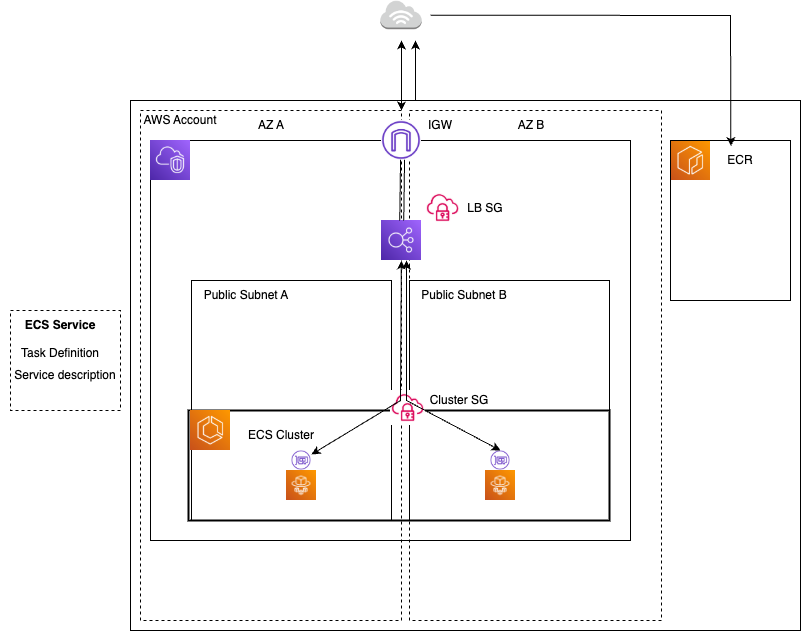

# DevOps Assessment Homework  

## Run the app

In a virtualenv, run:

    python setup.py install FLASK_APP=hello flask run

## Access the Application
[Link](http://hello-lb-59498855.eu-west-2.elb.amazonaws.com/)